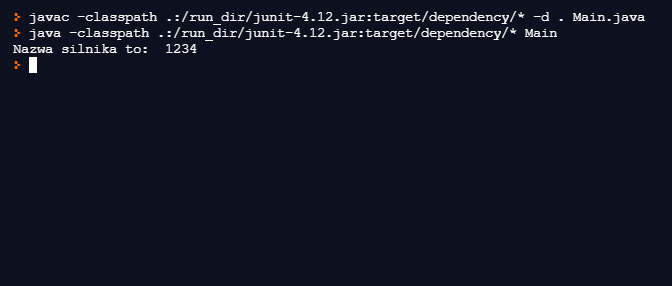

# Dziedziczenie5

## Table of content
* [General info](#General-info)
* [Images](#Images)
* [Technologies](#Technologies)
* [Setup](#Setup)
* [Features](#Features)
* [Status](#Status)

## General info
Simple Java code that uses inheritance and two class's to display the engines serial number. I made it for purely educational reasons.

## Images

## Technologies
* Java

## Setup
To run it you will need a Java interpreter like IntelliJ.

## Features
* All it does is display 1234 but with funky code

## Status
As of today the project is complete
